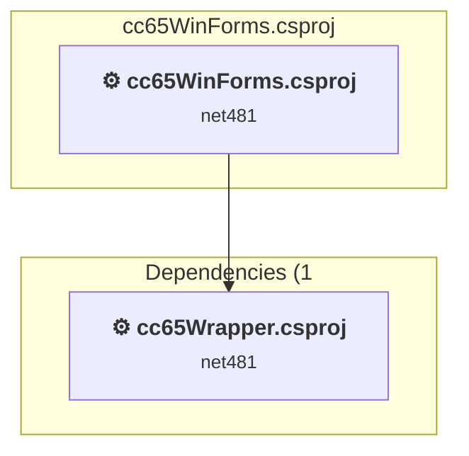
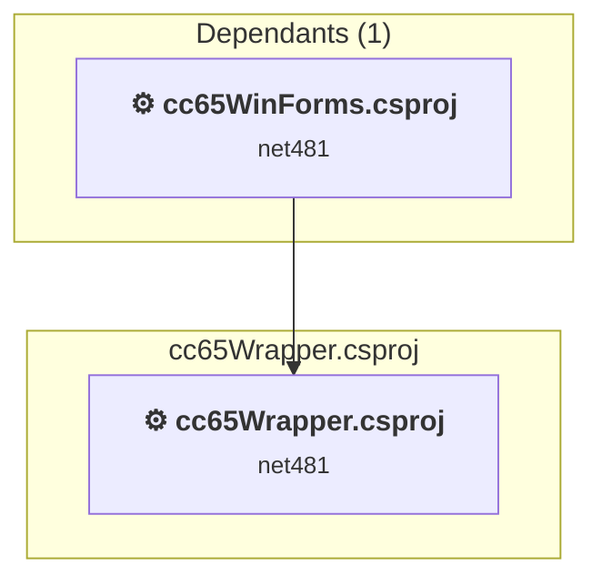

# Projects and dependencies analysis

This document provides a comprehensive overview of the projects and their dependencies in the context of upgrading to .NETCoreApp,Version=v10.0.

## Table of Contents

- [Executive Summary](#executive-Summary)
  - [Highlevel Metrics](#highlevel-metrics)
  - [Projects Compatibility](#projects-compatibility)
  - [Package Compatibility](#package-compatibility)
  - [API Compatibility](#api-compatibility)
  - [Binding Redirect Configuration](#binding-redirect-configuration)
- [Aggregate NuGet packages details](#aggregate-nuget-packages-details)
- [Top API Migration Challenges](#top-api-migration-challenges)
  - [Technologies and Features](#technologies-and-features)
  - [Most Frequent API Issues](#most-frequent-api-issues)
- [Projects Relationship Graph](#projects-relationship-graph)
- [Project Details](#project-details)

  - [cc65WinForms\cc65WinForms.csproj](#cc65winformscc65winformscsproj)
  - [cc65Wrapper\cc65Wrapper.csproj](#cc65wrappercc65wrappercsproj)

## Executive Summary

### Highlevel Metrics

| Metric | Count | Status |
| :--- | :---: | :--- |
| Total Projects | 2 | All require upgrade |
| Total NuGet Packages | 3 | 1 need upgrade |
| Total Code Files | 21 |  |
| Total Code Files with Incidents | 15 |  |
| Total Lines of Code | 3966 |  |
| Total Number of Issues | 2843 |  |
| Estimated LOC to modify | 2836+ | at least 71.5% of codebase |

### Projects Compatibility

| Project | Target Framework | Difficulty | Package Issues | API Issues | Binding Issues | Est. LOC Impact | Description |
| :--- | :---: | :---: | :---: | :---: | :---: | :---: | :--- |
| [cc65WinForms\cc65WinForms.csproj](#cc65winformscc65winformscsproj) | net481 | 🟡 Medium | 0 | 2831 | 0 | 2831+ | ClassicWinForms, Sdk Style = False |
| [cc65Wrapper\cc65Wrapper.csproj](#cc65wrappercc65wrappercsproj) | net481 | 🟢 Low | 1 | 5 | 2 | 5+ | ClassicClassLibrary, Sdk Style = False |

### Package Compatibility

| Status | Count | Percentage |
| :--- | :---: | :---: |
| ✅ Compatible | 2 | 66.7% |
| ⚠️ Incompatible | 0 | 0.0% |
| 🔄 Upgrade Recommended | 1 | 33.3% |
| ***Total NuGet Packages*** | ***3*** | ***100%*** |

### API Compatibility

| Category | Count | Impact |
| :--- | :---: | :--- |
| 🔴 Binary Incompatible | 2594 | High - Require code changes |
| 🟡 Source Incompatible | 237 | Medium - Needs re-compilation and potential conflicting API error fixing |
| 🔵 Behavioral change | 5 | Low - Behavioral changes that may require testing at runtime |
| ✅ Compatible | 2625 |  |
| ***Total APIs Analyzed*** | ***5461*** |  |

### Binding Redirect Configuration

| Severity | Count | Description |
| :--- | :---: | :--- |
| 🟡Potential | 2 | May cause issues in certain scenarios |
| ***Total Binding Issues*** | ***2*** | ***Across 1 project(s)*** |

## Aggregate NuGet packages details

| Package | Current Version | Suggested Version | Projects | Description |
| :--- | :---: | :---: | :--- | :--- |
| CliWrap | 2.4.0 |  | [cc65Wrapper.csproj](#cc65wrappercc65wrappercsproj) | ✅Compatible |
| FCTB | 2.16.24 |  | [cc65WinForms.csproj](#cc65winformscc65winformscsproj) | ✅Compatible |
| Newtonsoft.Json | 13.0.3 | 13.0.4 | [cc65Wrapper.csproj](#cc65wrappercc65wrappercsproj) | NuGet package upgrade is recommended |

## Top API Migration Challenges

### Technologies and Features

| Technology | Issues | Percentage | Migration Path |
| :--- | :---: | :---: | :--- |
| Windows Forms | 2594 | 91.5% | Windows Forms APIs for building Windows desktop applications with traditional Forms-based UI that are available in .NET on Windows. Enable Windows Desktop support: Option 1 (Recommended): Target net9.0-windows; Option 2: Add <UseWindowsDesktop>true</UseWindowsDesktop>; Option 3 (Legacy): Use Microsoft.NET.Sdk.WindowsDesktop SDK. |
| GDI+ / System.Drawing | 235 | 8.3% | System.Drawing APIs for 2D graphics, imaging, and printing that are available via NuGet package System.Drawing.Common. Note: Not recommended for server scenarios due to Windows dependencies; consider cross-platform alternatives like SkiaSharp or ImageSharp for new code. |
| Windows Forms Legacy Controls | 164 | 5.8% | Legacy Windows Forms controls that have been removed from .NET Core/5+ including StatusBar, DataGrid, ContextMenu, MainMenu, MenuItem, and ToolBar. These controls were replaced by more modern alternatives. Use ToolStrip, MenuStrip, ContextMenuStrip, and DataGridView instead. |
| Legacy Configuration System | 2 | 0.1% | Legacy XML-based configuration system (app.config/web.config) that has been replaced by a more flexible configuration model in .NET Core. The old system was rigid and XML-based. Migrate to Microsoft.Extensions.Configuration with JSON/environment variables; use System.Configuration.ConfigurationManager NuGet package as interim bridge if needed. |

### Most Frequent API Issues

| API | Count | Percentage | Category |
| :--- | :---: | :---: | :--- |
| T:System.Windows.Forms.ToolStripMenuItem | 132 | 4.7% | Binary Incompatible |
| T:System.Windows.Forms.ToolStripButton | 123 | 4.3% | Binary Incompatible |
| T:System.Windows.Forms.Label | 115 | 4.1% | Binary Incompatible |
| T:System.Windows.Forms.TextBox | 81 | 2.9% | Binary Incompatible |
| T:System.Windows.Forms.DockStyle | 78 | 2.8% | Binary Incompatible |
| T:System.Windows.Forms.TableLayoutPanel | 77 | 2.7% | Binary Incompatible |
| T:System.Drawing.Bitmap | 58 | 2.0% | Source Incompatible |
| T:System.Windows.Forms.Padding | 50 | 1.8% | Binary Incompatible |
| T:System.Windows.Forms.SplitContainer | 47 | 1.7% | Binary Incompatible |
| T:System.Windows.Forms.ToolStripSeparator | 42 | 1.5% | Binary Incompatible |
| T:System.Windows.Forms.DataGridViewTextBoxColumn | 40 | 1.4% | Binary Incompatible |
| T:System.Windows.Forms.Button | 38 | 1.3% | Binary Incompatible |
| P:System.Windows.Forms.ToolStripItem.Name | 36 | 1.3% | Binary Incompatible |
| P:System.Windows.Forms.Control.Name | 35 | 1.2% | Binary Incompatible |
| T:System.Windows.Forms.ToolStripStatusLabel | 35 | 1.2% | Binary Incompatible |
| P:System.Windows.Forms.ToolStripItem.Size | 35 | 1.2% | Binary Incompatible |
| T:System.Drawing.Font | 33 | 1.2% | Source Incompatible |
| P:System.Windows.Forms.Control.TabIndex | 33 | 1.2% | Binary Incompatible |
| T:System.Windows.Forms.SizeType | 32 | 1.1% | Binary Incompatible |
| P:System.Windows.Forms.Control.Location | 31 | 1.1% | Binary Incompatible |
| P:System.Windows.Forms.ToolStripItem.Text | 31 | 1.1% | Binary Incompatible |
| T:System.Windows.Forms.ToolStripItemDisplayStyle | 30 | 1.1% | Binary Incompatible |
| P:System.Windows.Forms.Control.Size | 29 | 1.0% | Binary Incompatible |
| T:System.Windows.Forms.DataGridView | 29 | 1.0% | Binary Incompatible |
| T:System.Windows.Forms.DialogResult | 27 | 1.0% | Binary Incompatible |
| T:System.Windows.Forms.ToolStripStatusLabelBorderSides | 27 | 1.0% | Binary Incompatible |
| T:System.Drawing.FontStyle | 26 | 0.9% | Source Incompatible |
| P:System.Windows.Forms.Control.Dock | 24 | 0.8% | Binary Incompatible |
| T:System.Drawing.ContentAlignment | 24 | 0.8% | Source Incompatible |
| F:System.Windows.Forms.DockStyle.Fill | 23 | 0.8% | Binary Incompatible |
| T:System.Windows.Forms.Control.ControlCollection | 22 | 0.8% | Binary Incompatible |
| P:System.Windows.Forms.Control.Controls | 22 | 0.8% | Binary Incompatible |
| M:System.Windows.Forms.Padding.#ctor(System.Int32,System.Int32,System.Int32,System.Int32) | 20 | 0.7% | Binary Incompatible |
| T:System.Drawing.GraphicsUnit | 20 | 0.7% | Source Incompatible |
| T:System.Windows.Forms.TreeView | 20 | 0.7% | Binary Incompatible |
| T:System.Windows.Forms.Keys | 19 | 0.7% | Binary Incompatible |
| E:System.Windows.Forms.ToolStripItem.Click | 19 | 0.7% | Binary Incompatible |
| M:System.Windows.Forms.Control.ResumeLayout(System.Boolean) | 18 | 0.6% | Binary Incompatible |
| T:System.Windows.Forms.BorderStyle | 18 | 0.6% | Binary Incompatible |
| T:System.Windows.Forms.TableLayoutControlCollection | 18 | 0.6% | Binary Incompatible |
| P:System.Windows.Forms.TableLayoutPanel.Controls | 18 | 0.6% | Binary Incompatible |
| M:System.Windows.Forms.TableLayoutControlCollection.Add(System.Windows.Forms.Control,System.Int32,System.Int32) | 18 | 0.6% | Binary Incompatible |
| M:System.Windows.Forms.Control.SuspendLayout | 18 | 0.6% | Binary Incompatible |
| T:System.Windows.Forms.MenuStrip | 18 | 0.6% | Binary Incompatible |
| T:System.Windows.Forms.CheckBox | 16 | 0.6% | Binary Incompatible |
| T:System.Windows.Forms.ComboBox | 16 | 0.6% | Binary Incompatible |
| T:System.Windows.Forms.StatusStrip | 16 | 0.6% | Binary Incompatible |
| P:System.Windows.Forms.TextBox.Text | 15 | 0.5% | Binary Incompatible |
| T:System.Windows.Forms.SplitterPanel | 15 | 0.5% | Binary Incompatible |
| M:System.Windows.Forms.ToolStripMenuItem.#ctor | 15 | 0.5% | Binary Incompatible |

## Projects Relationship Graph

Legend:
📦 SDK-style project
⚙️ Classic project

## Project Details

### cc65WinForms\cc65WinForms.csproj

#### Project Info

- **Current Target Framework:** net481
- **Proposed Target Framework:** net10.0-windows
- **SDK-style**: False
- **Project Kind:** ClassicWinForms
- **Dependencies**: 1
- **Dependants**: 0
- **Number of Files**: 17
- **Number of Files with Incidents**: 12
- **Lines of Code**: 3175
- **Estimated LOC to modify**: 2831+ (at least 89.2% of the project)

#### Dependency Graph

Legend:
📦 SDK-style project
⚙️ Classic project

### API Compatibility

| Category | Count | Impact |
| :--- | :---: | :--- |
| 🔴 Binary Incompatible | 2594 | High - Require code changes |
| 🟡 Source Incompatible | 237 | Medium - Needs re-compilation and potential conflicting API error fixing |
| 🔵 Behavioral change | 0 | Low - Behavioral changes that may require testing at runtime |
| ✅ Compatible | 2025 |  |
| ***Total APIs Analyzed*** | ***4856*** |  |

#### Project Technologies and Features

| Technology | Issues | Percentage | Migration Path |
| :--- | :---: | :---: | :--- |
| Legacy Configuration System | 2 | 0.1% | Legacy XML-based configuration system (app.config/web.config) that has been replaced by a more flexible configuration model in .NET Core. The old system was rigid and XML-based. Migrate to Microsoft.Extensions.Configuration with JSON/environment variables; use System.Configuration.ConfigurationManager NuGet package as interim bridge if needed. |
| GDI+ / System.Drawing | 235 | 8.3% | System.Drawing APIs for 2D graphics, imaging, and printing that are available via NuGet package System.Drawing.Common. Note: Not recommended for server scenarios due to Windows dependencies; consider cross-platform alternatives like SkiaSharp or ImageSharp for new code. |
| Windows Forms Legacy Controls | 164 | 5.8% | Legacy Windows Forms controls that have been removed from .NET Core/5+ including StatusBar, DataGrid, ContextMenu, MainMenu, MenuItem, and ToolBar. These controls were replaced by more modern alternatives. Use ToolStrip, MenuStrip, ContextMenuStrip, and DataGridView instead. |
| Windows Forms | 2594 | 91.6% | Windows Forms APIs for building Windows desktop applications with traditional Forms-based UI that are available in .NET on Windows. Enable Windows Desktop support: Option 1 (Recommended): Target net9.0-windows; Option 2: Add <UseWindowsDesktop>true</UseWindowsDesktop>; Option 3 (Legacy): Use Microsoft.NET.Sdk.WindowsDesktop SDK. |

### cc65Wrapper\cc65Wrapper.csproj

#### Project Info

- **Current Target Framework:** net481
- **Proposed Target Framework:** net10.0
- **SDK-style**: False
- **Project Kind:** ClassicClassLibrary
- **Dependencies**: 0
- **Dependants**: 1
- **Number of Files**: 8
- **Number of Files with Incidents**: 3
- **Lines of Code**: 791
- **Estimated LOC to modify**: 5+ (at least 0.6% of the project)

#### Dependency Graph

Legend:
📦 SDK-style project
⚙️ Classic project

### API Compatibility

| Category | Count | Impact |
| :--- | :---: | :--- |
| 🔴 Binary Incompatible | 0 | High - Require code changes |
| 🟡 Source Incompatible | 0 | Medium - Needs re-compilation and potential conflicting API error fixing |
| 🔵 Behavioral change | 5 | Low - Behavioral changes that may require testing at runtime |
| ✅ Compatible | 600 |  |
| ***Total APIs Analyzed*** | ***605*** |  |

#### Binding Redirect Configuration

| Rule | Severity | Details | Recommendation |
| :--- | :---: | :--- | :--- |
| Missing binding redirect for referenced assembly | 🟡Potential | Manual redirects exist but none covers CliWrap (referenced v2.4.0.0, package v2.4.0) | Add a binding redirect for the missing assembly. |
| Missing binding redirect for referenced assembly | 🟡Potential | Manual redirects exist but none covers Newtonsoft.Json (referenced v13.0.0.0, package v13.0.3) | Add a binding redirect for the missing assembly. |

